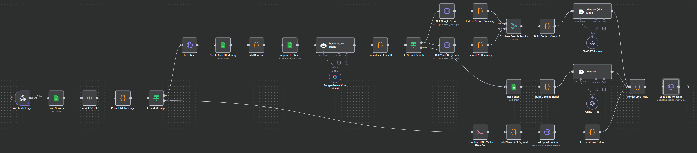

# 🤖 Line ChatBot – 擁有對話記憶功能 + Google 搜尋 + YouTube 搜尋 + OCR 圖片辨識的 GPT 聊天機器人

這是一個建構在 n8n 上的 LINE 聊天機器人工作流程，整合了 Google/YouTube 搜尋、OpenAI GPT、OCR 辨識圖片，以及訊息儲存與對話脈絡處理。

---

🟢 最新版本：v3（具備完整對話記憶、Google 搜尋及 YouTube 搜尋功能、OCR 圖片辨識）

其他版本：
- v2：具備完整記憶、Google 搜尋及 YouTube 搜尋功能
- v1：具備基本訊息記憶功能，最簡流程

---

## ✨ v3 版本功能特色

📚 訊息自動記憶：LINE 使用者訊息會自動儲存至 Google Sheets（每人一分頁），供 AI 提取上下文對話內容，實現「記憶功能」

🔍 智慧語意搜尋：當訊息開頭包含 google、search、搜尋 等關鍵字（不分大小寫），即自動觸發 Google 及 YouTube 搜尋，並回傳整理摘要

🤖 GPT-4o 自然回覆：整合 OpenAI GPT-4o 模型，根據上下文生成自然、貼近人類語氣的回覆，支援多輪互動

📸 圖片敘述能力：支援使用者上傳圖片，透過 GPT 模型進行敘述型辨識，能回覆帶有觀察與語氣的描述內容

🎭 可自訂 AI 性格：可以自訂 AI 的語氣與回應風格（如幽默、知性、開朗、柔和等），打造專屬個性化聊天體驗

🔐 集中管理憑證：所有敏感資訊集中儲存在 Google Sheets 的 Secrets 表單中，不需硬編碼，安全且易於維護與更新

---

🖼️ 使用流程畫面預覽

以下是本專案的 n8n 工作流程總覽，涵蓋 LINE webhook、訊息記錄、AI 回覆、Google 搜尋、OCR 分析等節點：

[](./assets/screenshot.png)

你可以依據自己的需求，增減節點或功能，打造專屬的 LINE AI ChatBot。

---

🔎 觸發即時搜尋的方式：

當使用者傳送的訊息用以下任一關鍵字開頭（不分大小寫），系統將自動進行即時搜尋並回傳整理後的資訊摘要：

"google"、"search"、"搜尋"

範例訊息如：「search GPT-4 是什麼」、「Google 台積電股票」、「搜尋 AI 未來發展」等。

---

## 🚀 快速部署說明

### 1️⃣ 建立 LINE Messaging API channel 並取得 Token

請至 [LINE Developers Console](https://developers.line.biz/console/) 建立一個 Messaging API channel，並取得以下資訊：

- `Channel Access Token`（加入到 Secrets 表中，key 為：`LINE_CHANNEL_TOKEN`）
- （可選）`Channel Secret`（若啟用簽章驗證，可存為 `LINE_CHANNEL_SECRET`）

完成後記得將 webhook URL 加入 LINE 設定，範例如下 👇

---

### 2️⃣ 建立 ngrok 靜態 HTTPS 網址供 webhook 使用

n8n 的 webhook 需要公開網址才能讓 LINE 觸發。

免費版 ngrok 提供一個靜態 HTTPS 網址，可至官網申請。

在電腦上執行：

```bash
ngrok http 5678
```

複製 Forwarding 網址：https://你的子網域.ngrok-free.app

網址後面加上：webhook/line-agent

如下：

```
https://你的子網域.ngrok-free.app/webhook/line-agent
```

請將此網址貼入 LINE Developers Console 的 Webhook URL 設定中。

使用動態 URL 也可以，但每次重開 ngrok 都需要更新 Webhook URL。

也可以使用 Cloudflare Worker 等服務來替代 ngrok，功能相同。

---

### 3️⃣ 建立 Google Sheets：Secrets 表單 + 訊息資料庫

請建立兩份 Google Sheet (勿公開權限)：

#### 第一份：將 Sheet 內的 "工作表一" 改名為 Secrets（必要）
用來集中儲存各項憑證資訊，格式如下：

| key                  | value                              |說明                                 |
|----------------------|------------------------------------|--------------------------------------|
| LINE_CHANNEL_TOKEN   | xxxxx                              | LINE Bot 的 Access Token（必要）     |
| OPENAI_LINE_BOT      | sk-xxxxx                           | OpenAI 的 API 金鑰             |
| GOOGLE_SEARCH_API    | AIza...                            | Google Search API / YouTube Data API 金鑰 |
| GOOGLE_CX_ID         | 1a2b3c4d...                        | Google Custom Search 引擎 ID         |
| DATABASE_LINE_BOT_ID | 1lbEeiAhMl-0P5xhtdP...             | 儲存訊息用的 Google Sheet 文件 ID      |

🔐 必要項目："key" (名稱) 及 "value" (API/secret 的值)

#### 第二份：隨意命名，用作訊息資料庫，將此 Sheet 的 ID 存入 Secrets 表單中：

"key" = DATABASE_LINE_BOT_ID

"value" = 此 Sheet 的 ID

本 workflow 執行時，會自動為每位使用者建立對應的分頁，並儲存他們傳送的訊息。

之後每次對話時，AI 會自動從該使用者的分頁讀取訊息記錄作為參考。

---

📸 圖片讀取機制：

目前使用 `curl` 下載使用者傳到 LINE 的圖片，並轉為 base64 給 GPT 處理，因此需確保系統已安裝 curl。

此方法可處理圖片至約 1MB，超過此大小的圖片可能會因轉換失敗導致無法處理。

我曾嘗試使用 n8n 的內建 HTTP Request + binary 流程，但經常遇到 binary 輸出為空或無法正確讀取圖片，故暫時採用 curl 方案。

未來若找到更好的解方，將更新 workflow 並同步 readme。

---

📦 補充說明：若覺得目前 v3 版本流程或設定過於複雜，也可參考功能較簡化的舊版：

- **v1 版本**：最簡化的記憶型 ChatBot，只具備基本訊息記錄與 AI 對話功能，適合初學及測試用途。
- **v2 版本**：整合 Google Sheets 作為訊息資料庫，並加入智慧搜尋（Google/YouTube），功能完整但架構仍精簡。

兩個舊版 workflow 檔案皆附在 repo 中，可依需求挑選使用。

---

⚠️ 其他注意事項：

1. 本專案目前未使用 RAG（Retrieval-Augmented Generation）技術。

儲存在 Sheets 中的對話記憶會全部傳入 GPT 模型中處理 (每名使用者分開)。

若訊息累積過多，可能會導致 API Token 使用量大幅增加，請自行斟酌管理訊息保留長度。

未來版本有可能會整合簡易 RAG 機制以優化成本與效能。

2. 一般對話及圖片辨識功能的預設模型為 GPT-4o，處理即時搜尋結果則用 4o-mini 以節省成本。

若有成本考量，也可改為使用 Google Gemini Flash，API 免費額度更高。

---

## 📬 聯絡作者

如果有任何問題，或對流程設計有改進建議，歡迎開 issue 或直接聯絡我：

- GitHub：[@JoshuaWang2211](https://github.com/JoshuaWang2211)  

---

本專案由作者 Joshua Wang 採取 vibe-coding 方式一邊學習、一邊實作，目的是探索 n8n 與 AI 整合的各種可能性。

開發節奏自由，功能也會依照實際需求或新想法不定期更新。歡迎對 AI 工作流程、chatbot 或 n8n 有興趣的朋友參考、延伸，或一起交流改進。

說明文件主要由 ChatGPT 協助生成，重要段落我已補充調整，其餘細節請直接參閱 workflow。